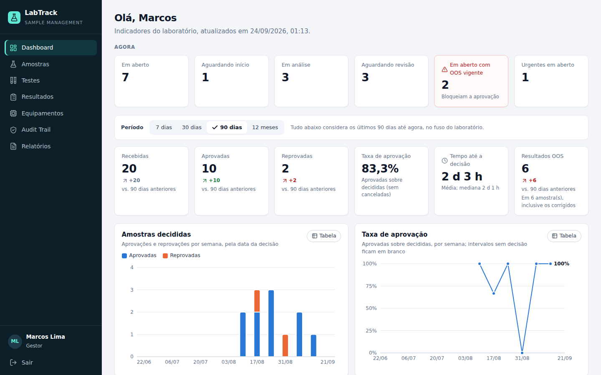
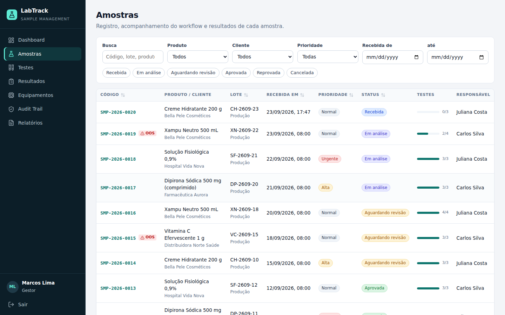
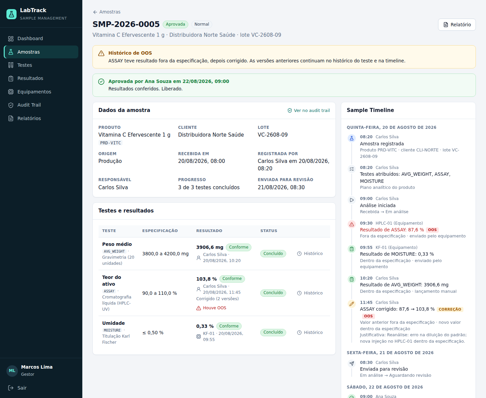
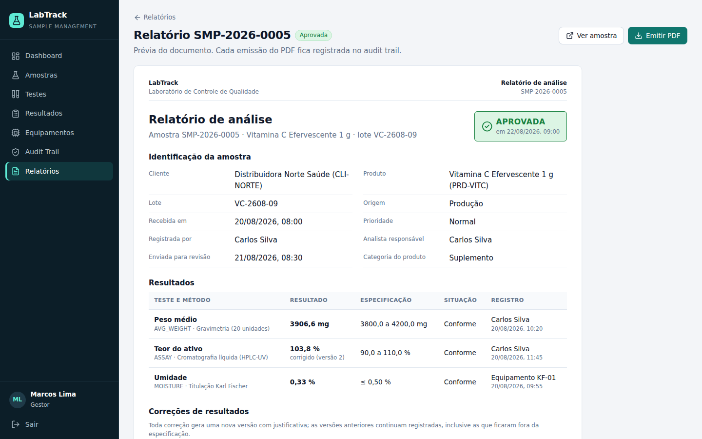
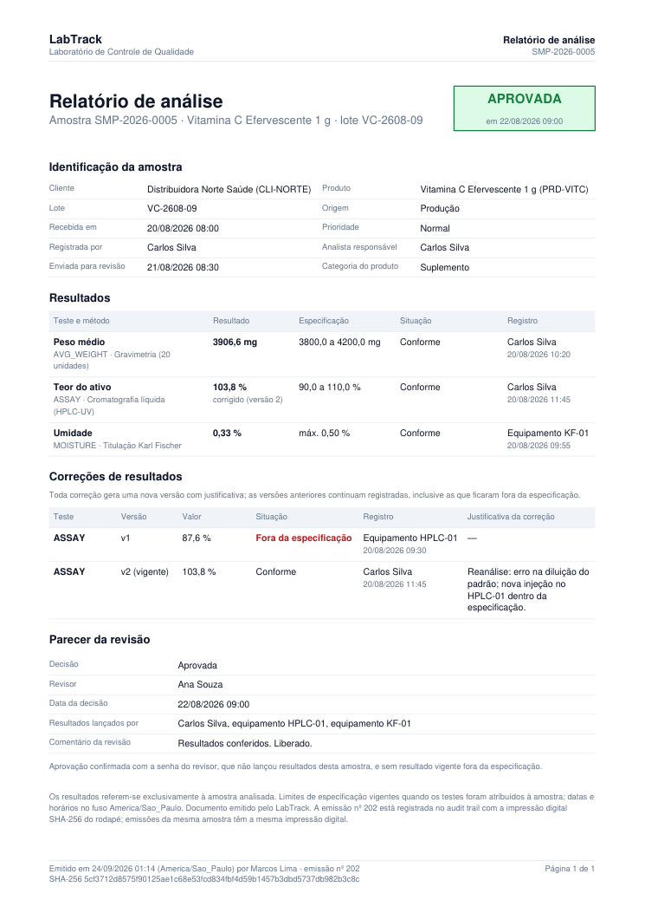
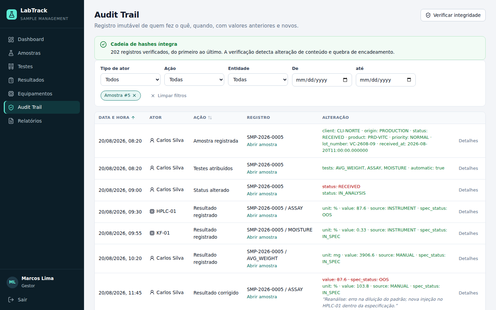
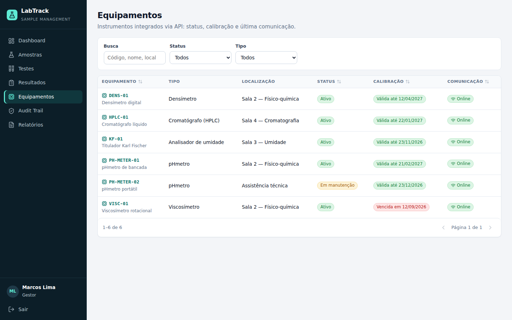
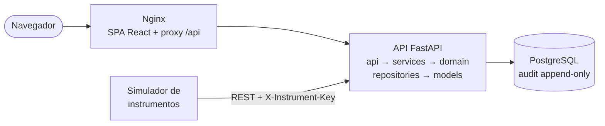

# LabTrack — Laboratory Sample Management System

[](https://github.com/GSHolanda/labtrack_gerenciamento_de_sistema/actions/workflows/ci.yml)

**Mini-LIMS** que acompanha o ciclo de vida de uma amostra de laboratório, do
recebimento à aprovação ou reprovação, com regras de negócio de um ambiente
regulado, integração com instrumentos, audit trail imutável e relatório em PDF.



> Projeto de portfólio concluído em [14 etapas](docs/roadmap.md), cada uma
> testada e documentada. Os relatórios das etapas finais estão em
> [`docs/relatorios/`](docs/relatorios/).

## O problema

Laboratórios de controle de qualidade processam centenas de amostras. Sem um
sistema dedicado, os dados ficam espalhados em planilhas e cadernos, e fica
difícil responder perguntas básicas:

- Em que etapa está a amostra do lote X?
- Quem inseriu este resultado, quando, e ele foi alterado?
- Algum resultado ficou fora da especificação? Quem aprovou mesmo assim?
- O valor veio do equipamento ou foi digitado?

## A solução

```
Recebida → Em análise → Aguardando revisão → Aprovada / Reprovada
                ↑               │
                └── devolvida ──┘            (Cancelada: decisão do gestor)
```

- **Workflow com máquina de estados**: nenhuma etapa é pulada. Não se aprova
  amostra com teste pendente, com resultado vigente fora da especificação, sem
  a senha do revisor ou revisada por quem lançou resultados.
- **Avaliação automática de especificação** com `Decimal`: todo resultado é
  classificado como conforme ou **OOS** (*out of specification*).
- **Resultados versionados**: correções criam nova versão com justificativa; o
  valor original, inclusive um OOS, nunca some.
- **Audit trail imutável**: quem, quando, o quê, valor anterior e novo, com
  cadeia de hashes que detecta adulteração e trigger que bloqueia alterações.
- **Integração com instrumentos** por API REST com chave própria de cada
  equipamento, e um simulador que usa só essa API.
- **Controle de acesso por perfil**: Administrador, Analista, Revisor e Gestor.
- **Dashboard, Sample Timeline e relatório em PDF** com impressão digital
  registrada no audit trail.

## Execução rápida (Docker)

```bash
docker compose up --build
```

Abra http://localhost:8080 e entre com um dos usuários listados no login (senha
`Demo@2026`): `carlos.silva` (analista), `ana.souza` (revisora),
`marcos.lima` (gestor) ou `admin`. O compose sobe o PostgreSQL, aplica as
migrações, gera a demonstração (20 amostras em todas as etapas do fluxo, 6
equipamentos), a API, a interface servida pelo Nginx e o simulador enviando
resultados. O Swagger fica em http://localhost:8080/docs. Serviços, variáveis e
o caminho para produção estão em [docs/deployment.md](docs/deployment.md).

## Um passeio pelo sistema

| | |
| --- | --- |
|  **Amostras**: filtros na URL, progresso dos testes e alerta de OOS. |  **Detalhe e Sample Timeline**: resultados com origem (usuário ou equipamento), histórico de versões e a linha do tempo do audit trail. |
|  **Relatório**: prévia com o mesmo conteúdo do PDF e emissão auditada. |  **PDF**: correções com todas as versões, parecer da revisão e impressão digital SHA-256. |
|  **Audit trail**: valores anteriores e novos, justificativas e verificação da cadeia de hashes. |  **Equipamentos**: status, calibração e comunicação; chave exibida uma única vez. |

## Funcionalidades

**Amostras e workflow.** Código `SMP-AAAA-NNNN` gerado sem colisão mesmo com
registros simultâneos; plano analítico do produto atribuído automaticamente com
os limites copiados no momento (mudar a especificação depois não altera amostras
existentes); ações do workflow conforme status e perfil; justificativa
obrigatória para reprovar, devolver e cancelar; amostra finalizada imutável.

**Resultados e OOS.** Limites inclusivos, especificação unilateral, casas
decimais por teste sem arredondar dígitos registrados; correção versionada com
justificativa; OOS corrigido continua sinalizado ao revisor, na timeline e no
relatório.

**Revisão.** Aprovação com confirmação de senha (conceito de assinatura
eletrônica), bloqueada por OOS vigente e pelo princípio dos quatro olhos.

**Audit trail.** Gravado na mesma transação da operação; *append-only* por
trigger no PostgreSQL; hash encadeado verificável pela interface; Sample
Timeline por amostra com correções e OOS destacados.

**Integração com instrumentos.** Worklist, envio de resultado e *heartbeat*
autenticados por chave (guardada só como hash); equipamento ativo, calibrado e
compatível com o teste; unidade exata; nenhuma sobrescrita; toda mensagem
registrada, aceita ou recusada, com o payload original.

**Dashboard.** Carga de trabalho atual, indicadores do período comparados ao
anterior e gráficos acessíveis (tooltip por teclado, tabela equivalente, cores
validadas para daltonismo), agrupados no fuso do laboratório.

**Relatórios.** Relatório de análise das amostras revisadas, em JSON e PDF; cada
emissão fica no audit trail com a impressão digital impressa no rodapé.

As 28 regras de negócio estão em [docs/sample-lifecycle.md](docs/sample-lifecycle.md),
cada uma ligada aos testes que a verificam em [docs/testing.md](docs/testing.md).

## Arquitetura

Monólito modular em camadas, com o simulador como processo separado que só
conhece a API:



A regra de dependência entre camadas é verificada por um teste de arquitetura
(por exemplo, `services` não importa FastAPI e `domain` não importa SQLAlchemy).
Detalhes e decisões em [docs/architecture.md](docs/architecture.md).

## Qualidade

| | |
| --- | --- |
| Testes | Backend: 469 em SQLite e 475 com a suíte inteira no PostgreSQL 16; simulador: 41; frontend: 94 (Vitest) |
| Cobertura | Backend 96,9% com ramos (mínimo 95%); frontend 79% das linhas (mínimo 75%) |
| Rastreabilidade | Cada regra RN-01 a RN-28 tem teste marcado; a suíte falha se alguma ficar sem teste |
| Ponta a ponta | Um cenário do cadastro do equipamento ao relatório, conferindo a timeline inteira |
| CI | GitHub Actions: backend, backend no PostgreSQL, simulador, frontend e a stack Docker com smoke test |

## Stack

| Camada          | Tecnologia                                                   |
| --------------- | ------------------------------------------------------------ |
| Frontend        | React 19, TypeScript, Vite, React Router, TanStack Query, Recharts |
| Backend         | Python 3.11+, FastAPI, Pydantic v2, ReportLab                |
| Persistência    | PostgreSQL 16, SQLAlchemy 2.0, Alembic                       |
| Segurança       | JWT, RBAC por permissões, bcrypt, chave de API por instrumento |
| Qualidade       | pytest, Vitest, Testing Library, Ruff, oxlint, GitHub Actions |
| Infraestrutura  | Docker, Docker Compose, Nginx                                |

## Estrutura do repositório

```
labtrack/
├── backend/                 # API REST (FastAPI) em camadas
│   ├── app/
│   │   ├── api/             #   HTTP: rotas, autenticação, erros
│   │   ├── services/        #   Casos de uso, transações, audit, PDF
│   │   ├── domain/          #   Regras puras: workflow, OOS, permissões
│   │   ├── repositories/    #   Acesso a dados
│   │   ├── models/          #   ORM SQLAlchemy
│   │   ├── schemas/         #   Contratos da API (Pydantic)
│   │   ├── database/        #   Engine, sessão, base declarativa
│   │   ├── cli/             #   create-admin e seed-demo
│   │   └── core/            #   Configuração, logs, segurança
│   ├── alembic/             #   Migrações
│   └── tests/               #   Unitários, API, banco e ponta a ponta
├── frontend/                # Cliente web React + TypeScript (+ Nginx)
├── instrument-simulator/    # Simulador de equipamentos (processo separado)
├── scripts/                 # Smoke test da stack Docker
├── docker-compose.yml       # Stack completa (ou só o banco: docker compose up -d db)
└── docs/                    # Arquitetura, dados, API, fluxo, testes, Docker, apresentação
```

## Documentação

| Documento                                        | Conteúdo                                                        |
| ------------------------------------------------ | --------------------------------------------------------------- |
| [Arquitetura](docs/architecture.md)              | Camadas, regra de dependência, decisões técnicas, troca de tecnologia |
| [Modelo de dados](docs/database.md)              | Diagrama ER, dicionário de dados, constraints e índices         |
| [API](docs/api.md)                               | Endpoints, matriz de permissões, integração com instrumentos    |
| [Ciclo da amostra](docs/sample-lifecycle.md)     | Máquina de estados, regras de negócio (RN-01 a RN-28), timeline |
| [Testes](docs/testing.md)                        | Camadas de teste, CI, cobertura e matriz regra → teste          |
| [Execução com Docker](docs/deployment.md)        | Serviços, imagens, variáveis, produção e smoke test             |
| [Apresentação](docs/apresentacao.md)             | Roteiro de 5 minutos, demonstração e perguntas de entrevista    |
| [Plano de implementação](docs/roadmap.md)        | As 14 etapas e o que cada uma entregou                          |
| READMEs de [backend](backend/README.md), [frontend](frontend/README.md) e [simulador](instrument-simulator/README.md) | Execução e decisões de cada parte |

## Desenvolvimento local

**Backend**

```bash
docker compose up -d db            # só o PostgreSQL
cd backend
python -m venv .venv
source .venv/bin/activate          # Windows: .venv\Scripts\activate
pip install -e ".[dev]"
alembic upgrade head               # cria as tabelas e os perfis
python -m app.cli seed-demo --simulator-config ../instrument-simulator/config.json
uvicorn app.main:app --reload      # http://localhost:8000/docs
pytest                             # testes (pytest --cov, pytest --postgres)
```

Num banco vazio, `seed-demo` gera a demonstração pelos próprios serviços da API
(senha `Demo@2026` ou `LABTRACK_DEMO_PASSWORD`). Para começar sem demonstração,
use `python -m app.cli create-admin`.

**Simulador de instrumentos**

```bash
cd instrument-simulator
pip install -e ".[dev]"
python -m simulator worklist           # testes pendentes por equipamento
python -m simulator run --once         # mede e envia os resultados pela API
```

**Frontend**

```bash
cd frontend
npm install
npm run dev                        # http://localhost:5173 (usa a API em :8000)
npm test                           # testes (Vitest)
```

## Integridade de dados

O LabTrack aplica boas práticas de rastreabilidade e integridade de dados
comuns em sistemas laboratoriais. **Não há alegação de conformidade oficial
com normas ou regulamentações.** É um projeto de portfólio que demonstra os
conceitos.

Este é um projeto autoral e independente. Não reproduz código, layout ou
funcionalidades proprietárias de nenhum produto LIMS comercial.
