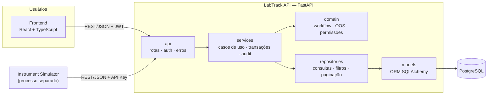

# Arquitetura do LabTrack

## 1. Visão geral

O LabTrack é um **monólito modular em camadas** com três componentes que se
comunicam apenas por contratos HTTP/JSON:

| Componente               | Tecnologia                         | Responsabilidade                                                      |
| ------------------------ | ---------------------------------- | --------------------------------------------------------------------- |
| **Frontend**             | React + TypeScript (Vite)          | Interface web para analistas, revisores, gestores e administradores   |
| **Backend (API)**        | Python + FastAPI + SQLAlchemy      | Regras de negócio, workflow, audit trail, relatórios, integração      |
| **Banco de dados**       | PostgreSQL                         | Persistência relacional com constraints, índices e trilha imutável    |
| **Instrument Simulator** | Python (processo separado)         | Simula equipamentos enviando resultados pela API REST                 |



### Por que um monólito modular (e não microsserviços)?

- **Consistência transacional**: uma mudança de resultado e o seu registro no
  audit trail são gravados na **mesma transação**. Não existe o risco de a
  alteração acontecer e a trilha de auditoria se perder.
- **Operação simples**: um único deploy, um único banco, fácil de demonstrar.
- **Fronteiras claras**: cada módulo (samples, results, instruments, audit...)
  tem seus próprios serviços e repositórios. Se um dia fizer sentido extrair,
  por exemplo, a integração de instrumentos para um serviço separado, a
  fronteira já existe.

## 2. Camadas do backend e regra de dependência

```
app/
├── api/            HTTP: rotas, dependências (sessão, usuário, permissão), erros → status HTTP
├── services/       Casos de uso: orquestram repositórios + domínio numa transação
├── domain/         Regras puras: enums, máquina de estados, avaliação OOS, matriz RBAC
├── repositories/   Acesso a dados: consultas, filtros, paginação (sem regra de negócio)
├── models/         Mapeamento ORM das tabelas
├── schemas/        DTOs Pydantic (contratos públicos da API)
├── database/       Engine, sessão, base declarativa, convenção de nomes
└── core/           Transversal: configuração, logs, segurança, exceções
```

**Regra de dependência**: as setas apontam sempre "para dentro". A camada
`domain` não conhece nenhuma outra; `services` não conhece HTTP; `api` não
acessa repositórios diretamente.

| Camada         | Não pode importar                                                  |
| -------------- | ------------------------------------------------------------------ |
| `core`         | nenhuma outra camada da aplicação                                  |
| `domain`       | FastAPI, SQLAlchemy, `api`, `services`, `repositories`, `models`   |
| `models`       | FastAPI, `api`, `services`, `repositories`, `schemas`              |
| `schemas`      | SQLAlchemy, `api`, `services`, `repositories`, `models`            |
| `repositories` | FastAPI, `api`, `services`                                         |
| `services`     | FastAPI, `api`                                                     |
| `api`          | `repositories` (sempre passa por `services`)                       |

Essa regra é **verificada automaticamente** por
[`backend/tests/unit/test_architecture.py`](../backend/tests/unit/test_architecture.py),
um teste de arquitetura no estilo ArchUnit. Se alguém importar FastAPI dentro
de um serviço, o teste falha.

### Caminho de uma requisição

```
POST /api/v1/sample-tests/42/results
  │
  ├─ api/            valida o JSON (schema), autentica o JWT, checa a permissão RESULT_ENTER
  ├─ services/       ResultService.record_result()
  │    ├─ repositories/  carrega o teste atribuído e a amostra
  │    ├─ domain/        a amostra está em IN_ANALYSIS? o valor está dentro da especificação?
  │    ├─ repositories/  grava test_results (nova versão) e atualiza sample_tests
  │    ├─ services/      AuditService.record(...)  ← mesma transação
  │    └─ commit
  └─ api/            serializa a resposta (schema) → 201 Created
```

## 3. Frontend

Organização **por feature**: cada item do menu (Dashboard, Samples, Tests,
Results, Instruments, Audit Trail, Reports, Administration) é um módulo em
`src/features/` com suas páginas, hooks e componentes. Componentes genéricos
(tabela, badge de status, cards) ficam em `src/components/`, e todo acesso HTTP
fica em `src/api/`.

- **Roteamento**: React Router, com rotas protegidas por perfil.
- **Estado de servidor**: TanStack Query (cache, refetch, estados de loading/erro).
- **Gráficos**: Recharts.
- **Permissões na UI**: botões e menus aparecem conforme o perfil, mas **a
  autorização real é sempre feita no backend**.

Em desenvolvimento, o Vite encaminha `/api` para o backend; em produção, o
Nginx faz o mesmo papel. O navegador fala com uma única origem.

Implementado na ETAPA 9 (detalhes em [`frontend/README.md`](../frontend/README.md)):

- **Sessão**: JWT no `sessionStorage`, validado em `GET /auth/me` ao abrir o app;
  `401` numa requisição autenticada ou a expiração do token encerram a sessão.
- **Permissões**: `layouts/navigation.ts` define, para cada área, as permissões
  que a acessam. O mesmo item monta o menu e protege a rota; botões de ação
  aparecem conforme as permissões de `/auth/me` e os `allowed_actions` da amostra.
- **Dados**: TanStack Query; cada operação atualiza o detalhe com a resposta da
  API e invalida listas, timeline e dashboard. Filtros e paginação ficam na URL.
- **Valores analíticos** tratados como texto decimal na interface inteira.
- **Dashboard** (ETAPA 10): indicadores e séries calculados no backend
  (`DashboardService`); a tela usa Recharts carregado sob demanda, com tabela
  equivalente para cada gráfico e cores validadas para daltonismo.

## 4. Instrument Simulator

Processo Python independente que só conhece a **API REST**. Ele se autentica
com uma chave por instrumento (`X-Instrument-Key`), consulta a *worklist*
(testes pendentes compatíveis com seu tipo), envia resultados e *heartbeats*.
Como o contrato é HTTP, o simulador pode ser trocado por um driver real ou por
um middleware de integração sem nenhuma mudança no backend.

```
instrument-simulator/simulator/
├── client.py        LabTrackClient: HTTP (httpx) + X-Instrument-Key; erros viram ApiError
├── measurement.py   leitura dentro da faixa central da especificação ou OOS
├── runner.py        ciclo: heartbeat → worklist → medir → enviar; relatório por ciclo
├── config.py        URL da API e chave de cada equipamento (config.json)
└── __main__.py      CLI: run, worklist, send, heartbeat
```

No backend, a integração fica em `InstrumentIntegrationService` (RN-19 a
RN-24) e a gestão em `InstrumentService`. As regras puras (calibração, janela
de online, compatibilidade de tipo e unidade) ficam em `domain/instruments.py`.

## 4.1 Dados de demonstração

`python -m app.cli seed-demo` popula um banco vazio chamando os **mesmos
serviços da API**: cadastros, amostras, resultados manuais e de instrumentos,
recusas de integração, correções e revisões. Nada é inserido direto nas
tabelas, então o audit trail, a cadeia de hashes e a timeline ficam coerentes.
Para distribuir o histórico nas semanas anteriores, os serviços obtêm a hora
de `core/clock.py`, que a geração fixa no momento de cada evento, sempre em
ordem cronológica. Na API o relógio é sempre o real; só o código do CLI pode
fixá-lo.

## 5. Aspectos transversais

| Aspecto                 | Abordagem                                                                                                                     |
| ----------------------- | ----------------------------------------------------------------------------------------------------------------------------- |
| **Autenticação**        | JWT (Bearer) para usuários; chave de API com hash por instrumento                                                             |
| **Autorização**         | RBAC: matriz perfil → permissões definida no domínio e aplicada por dependência do FastAPI em cada rota                       |
| **Transações**          | Uma transação por caso de uso, controlada pelo serviço (padrão *Unit of Work* da sessão SQLAlchemy)                           |
| **Audit trail**         | `AuditService` grava na mesma transação; tabela *append-only* (sem UPDATE/DELETE, com trigger no PostgreSQL) e hash encadeado |
| **Erros**               | Exceções de aplicação (`NotFound`, `BusinessRuleError`, `PermissionDenied`...) convertidas por um handler global em JSON padronizado |
| **Logs**                | Texto em desenvolvimento, JSON em produção, com `request_id` para correlação                                                  |
| **Validação**           | Pydantic na borda (formato) + regras de negócio nos serviços/domínio + constraints no banco (defesa em profundidade)           |
| **Datas**               | Armazenadas em UTC (`TIMESTAMPTZ`); convertidas para o fuso do usuário na interface. Eventos de negócio usam o relógio da aplicação (`core/clock.py`); indicadores agrupam dias e meses no fuso do laboratório (`LABTRACK_LAB_TIMEZONE`) |
| **Concorrência**        | *Optimistic locking* (coluna `version`) em amostras para evitar que duas pessoas sobrescrevam alterações                       |
| **Documentação da API** | OpenAPI/Swagger gerado automaticamente em `/docs`                                                                              |

## 6. Substituição de tecnologia

A separação em camadas limita o impacto de trocar uma peça da stack:

| Mudança                                         | O que é afetado                                                                  | O que **não** muda               |
| ----------------------------------------------- | -------------------------------------------------------------------------------- | -------------------------------- |
| PostgreSQL → SQL Server / Oracle                | `database/` (driver, URL), migrações, trigger de imutabilidade                   | `domain`, `services`, `api`      |
| FastAPI → outro framework web                   | `api/`                                                                           | `domain`, `services`, `repositories` |
| JWT local → SSO corporativo (OIDC, Azure AD)    | `core/security`, dependência de autenticação em `api/`                           | regras de permissão do domínio   |
| React → Angular / outro cliente                 | `frontend/` inteiro                                                              | backend (o contrato é o OpenAPI) |
| Gerador de PDF                                  | adaptador de relatório em `services/`                                            | dados do relatório               |
| Simulador → driver real / middleware            | nada no backend                                                                  | contrato REST de integração      |

## 7. Decisões arquiteturais

| #   | Decisão                                                                 | Motivo                                                                                                    |
| --- | ----------------------------------------------------------------------- | --------------------------------------------------------------------------------------------------------- |
| 1   | Monólito modular em camadas                                             | Consistência transacional entre dado e auditoria; simplicidade operacional                                |
| 2   | Camada `domain` sem dependências de framework                           | Regras críticas (workflow, OOS, permissões) testáveis isoladamente e portáveis                            |
| 3   | Audit trail gravado explicitamente pelos serviços                       | O serviço conhece a *semântica* (ação, motivo, valor anterior/novo); um trigger só veria colunas          |
| 4   | Audit trail imutável: sem rotas de alteração, trigger bloqueando UPDATE/DELETE e hash encadeado | Defesa em profundidade: aplicação, banco e verificação criptográfica de adulteração |
| 5   | Resultados **versionados**, nunca sobrescritos                          | Toda correção gera nova versão com justificativa; o valor original continua no banco                      |
| 6   | *Snapshot* da especificação ao atribuir o teste                         | Alterar o limite de um teste depois não muda a avaliação de amostras já analisadas                        |
| 7   | Valores analíticos em `NUMERIC`, não `FLOAT`                            | Evita erro de ponto flutuante na comparação com limites (ex.: 7.5 ≤ 7.5)                                  |
| 8   | Enums como `VARCHAR` + `CHECK`                                          | Portável entre bancos e simples de migrar (adicionar um status não exige `ALTER TYPE`)                    |
| 9   | Máquina de estados explícita (tabela de transições)                     | Regras de workflow num único lugar, fácil de revisar e testar                                             |
| 10  | Permissões definidas em código (RBAC)                                   | Versionadas junto com o sistema, revisáveis em code review e cobertas por testes                         |
| 11  | Integração de instrumentos via REST + log bruto das mensagens           | Toda mensagem recebida é rastreável, inclusive as rejeitadas, com o motivo                                |
| 12  | API versionada (`/api/v1`) e formato de erro padronizado                | Evolução sem quebrar clientes (frontend e instrumentos)                                                   |
| 13  | Segregação de funções (quem inseriu resultado não aprova a amostra)     | Princípio dos "quatro olhos", prática comum em laboratórios                                              |
| 14  | Chave de instrumento aleatória (256 bits) guardada como SHA-256         | Exibida uma vez; hash determinístico permite localizar o equipamento sem armazenar a chave; rotação revoga na hora |
| 15  | Mensagem de instrumento recusada é registrada em transação própria      | O resultado é descartado (rollback), mas o log e a auditoria da recusa são confirmados                    |
| 16  | Dados de demonstração gerados pelos serviços, com relógio controlado    | Mesmas validações e mesmo audit trail da operação real; histórico cronológico e verificável              |

## 8. Integridade de dados

O projeto aplica boas práticas de rastreabilidade e integridade de dados comuns
em ambientes laboratoriais (dados atribuíveis a um usuário ou equipamento,
registrados no momento em que acontecem, com histórico preservado e sem
exclusão física). **Não há qualquer alegação de conformidade oficial** com
normas ou regulamentações (como 21 CFR Part 11, EU GMP Anexo 11 ou ISO/IEC 17025).
É um projeto de portfólio que demonstra os conceitos.
