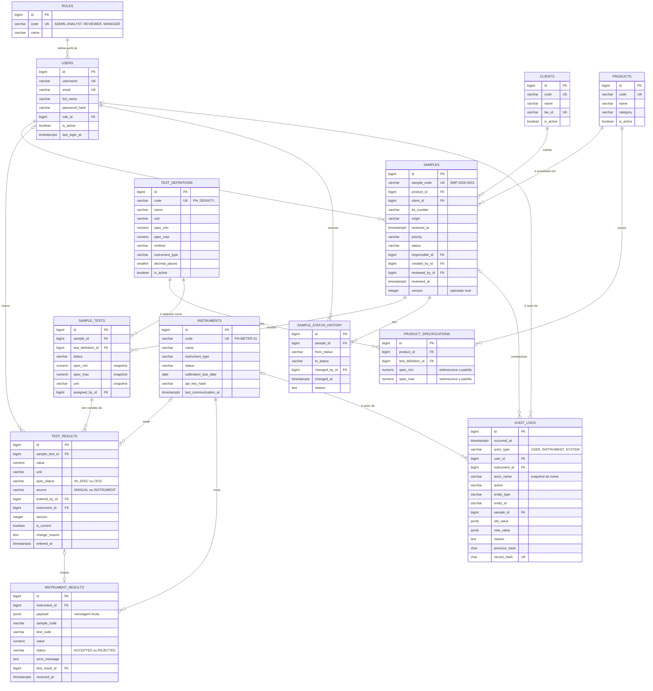

# Modelo de dados

Banco relacional **PostgreSQL**, mapeado com **SQLAlchemy 2.0** e versionado com
**Alembic**. São 13 tabelas, agrupadas em quatro blocos:

| Bloco                  | Tabelas                                                                    |
| ---------------------- | -------------------------------------------------------------------------- |
| Segurança              | `roles`, `users`                                                           |
| Cadastros (master data) | `clients`, `products`, `test_definitions`, `product_specifications`, `instruments` |
| Operação do laboratório | `samples`, `sample_status_history`, `sample_tests`, `test_results`        |
| Rastreabilidade e integração | `instrument_results`, `audit_logs`                                   |

## Diagrama ER



## Convenções

| Convenção              | Regra                                                                                               |
| ---------------------- | --------------------------------------------------------------------------------------------------- |
| Nomes                  | Tabelas no plural em `snake_case`; FKs como `<entidade>_id`                                          |
| Chave primária         | `id BIGINT GENERATED ALWAYS AS IDENTITY` (chave substituta)                                         |
| Chave de negócio       | Códigos legíveis com `UNIQUE` (`sample_code`, `code`), usados em telas, relatórios e integrações   |
| Timestamps             | `created_at` e `updated_at` (`TIMESTAMPTZ`, UTC, default `now()`) nas tabelas mutáveis             |
| Enums                  | `VARCHAR` + `CHECK (col IN (...))`, espelhando enums da camada `domain`                             |
| Valores analíticos     | `NUMERIC(14,4)`, nunca `FLOAT`                                                                      |
| Nomes de constraints   | Convenção fixa: `pk_`, `fk_`, `uq_`, `ix_`, `ck_` (migrações previsíveis)                           |
| Exclusão               | **Sem exclusão física** de dados do laboratório: FKs com `ON DELETE RESTRICT`; usuários, clientes, produtos e instrumentos são **desativados**; amostras são **canceladas** |

## Dicionário de dados

### `roles`
| Coluna        | Tipo         | Regras                                   |
| ------------- | ------------ | ---------------------------------------- |
| `id`          | BIGINT       | PK                                       |
| `code`        | VARCHAR(30)  | UNIQUE, CHECK em (`ADMIN`, `ANALYST`, `REVIEWER`, `MANAGER`) |
| `name`        | VARCHAR(80)  | NOT NULL                                 |
| `description` | TEXT         |                                          |
| `created_at`  | TIMESTAMPTZ  | NOT NULL                                 |

### `users`
| Coluna          | Tipo         | Regras                                   |
| --------------- | ------------ | ---------------------------------------- |
| `id`            | BIGINT       | PK                                       |
| `username`      | VARCHAR(50)  | UNIQUE, NOT NULL                         |
| `email`         | VARCHAR(255) | UNIQUE, NOT NULL                         |
| `full_name`     | VARCHAR(150) | NOT NULL                                 |
| `password_hash` | VARCHAR(255) | NOT NULL (hash, nunca a senha)           |
| `role_id`       | BIGINT       | FK → `roles`, NOT NULL, índice           |
| `is_active`     | BOOLEAN      | NOT NULL, default `true`                 |
| `last_login_at` | TIMESTAMPTZ  |                                          |
| `created_at` / `updated_at` | TIMESTAMPTZ | NOT NULL                       |

### `clients`
| Coluna          | Tipo         | Regras                         |
| --------------- | ------------ | ------------------------------ |
| `id`            | BIGINT       | PK                             |
| `code`          | VARCHAR(20)  | UNIQUE, NOT NULL               |
| `name`          | VARCHAR(150) | NOT NULL                       |
| `tax_id`        | VARCHAR(20)  | UNIQUE (CNPJ, opcional)        |
| `contact_email` | VARCHAR(255) |                                |
| `is_active`     | BOOLEAN      | NOT NULL, default `true`       |
| `created_at` / `updated_at` | TIMESTAMPTZ | NOT NULL             |

### `products`
| Coluna        | Tipo         | Regras                   |
| ------------- | ------------ | ------------------------ |
| `id`          | BIGINT       | PK                       |
| `code`        | VARCHAR(30)  | UNIQUE, NOT NULL         |
| `name`        | VARCHAR(150) | NOT NULL                 |
| `category`    | VARCHAR(80)  |                          |
| `description` | TEXT         |                          |
| `is_active`   | BOOLEAN      | NOT NULL, default `true` |
| `created_at` / `updated_at` | TIMESTAMPTZ | NOT NULL   |

### `test_definitions` — tipos de teste
| Coluna            | Tipo          | Regras                                                        |
| ----------------- | ------------- | ------------------------------------------------------------- |
| `id`              | BIGINT        | PK                                                            |
| `code`            | VARCHAR(30)   | UNIQUE, NOT NULL (ex.: `PH`, `DENSITY`); usado na integração  |
| `name`            | VARCHAR(100)  | NOT NULL                                                      |
| `unit`            | VARCHAR(20)   | NOT NULL                                                      |
| `spec_min`        | NUMERIC(14,4) | limite mínimo padrão (inclusivo)                              |
| `spec_max`        | NUMERIC(14,4) | limite máximo padrão (inclusivo)                              |
| `method`          | VARCHAR(150)  | NOT NULL, método de análise                                   |
| `instrument_type` | VARCHAR(40)   | tipo de equipamento utilizado (nulo = teste só manual)        |
| `decimal_places`  | SMALLINT      | NOT NULL, default 2, precisão de exibição                     |
| `description`     | TEXT          |                                                               |
| `is_active`       | BOOLEAN       | NOT NULL, default `true`                                      |

Constraints: `CHECK (spec_min IS NOT NULL OR spec_max IS NOT NULL)` (especificação
unilateral é permitida, como "≤ 0,5 %") e `CHECK (spec_min <= spec_max)` quando
ambos existem.

### `product_specifications` — plano analítico por produto
Define **quais testes** são atribuídos automaticamente quando uma amostra do
produto é registrada e, opcionalmente, **limites específicos do produto**
(o pH de um xampu e o de um colírio têm faixas diferentes).

| Coluna               | Tipo          | Regras                                        |
| -------------------- | ------------- | --------------------------------------------- |
| `id`                 | BIGINT        | PK                                            |
| `product_id`         | BIGINT        | FK → `products`, NOT NULL                     |
| `test_definition_id` | BIGINT        | FK → `test_definitions`, NOT NULL             |
| `spec_min`           | NUMERIC(14,4) | sobrescreve o limite padrão do teste (opcional) |
| `spec_max`           | NUMERIC(14,4) | sobrescreve o limite padrão do teste (opcional) |

Constraints: `UNIQUE (product_id, test_definition_id)`, `CHECK (spec_min <= spec_max)`.

### `instruments` — equipamentos
| Coluna                  | Tipo         | Regras                                                        |
| ----------------------- | ------------ | ------------------------------------------------------------- |
| `id`                    | BIGINT       | PK                                                            |
| `code`                  | VARCHAR(40)  | UNIQUE, NOT NULL (ex.: `PH-METER-01`)                         |
| `name`                  | VARCHAR(120) | NOT NULL                                                      |
| `instrument_type`       | VARCHAR(40)  | NOT NULL, índice                                              |
| `manufacturer` / `model` / `serial_number` | VARCHAR(80) | `serial_number` UNIQUE                   |
| `location`              | VARCHAR(80)  |                                                               |
| `status`                | VARCHAR(20)  | CHECK em (`ACTIVE`, `MAINTENANCE`, `INACTIVE`)                |
| `calibration_due_date`  | DATE         | instrumento com calibração vencida não envia resultados       |
| `api_key_hash`          | VARCHAR(255) | NOT NULL (hash da chave de integração)                        |
| `last_communication_at` | TIMESTAMPTZ  | atualizado a cada heartbeat ou resultado                      |

O status de conectividade (**online/offline**) é derivado de
`last_communication_at`, sem ser gravado.

### `samples` — amostras
| Coluna           | Tipo         | Regras                                                                      |
| ---------------- | ------------ | --------------------------------------------------------------------------- |
| `id`             | BIGINT       | PK                                                                          |
| `sample_code`    | VARCHAR(20)  | UNIQUE, NOT NULL, gerado pelo sistema (`SMP-AAAA-NNNN`, sequencial por ano) |
| `product_id`     | BIGINT       | FK → `products`, NOT NULL, índice                                           |
| `client_id`      | BIGINT       | FK → `clients`, NOT NULL, índice                                            |
| `lot_number`     | VARCHAR(50)  | NOT NULL, índice                                                            |
| `origin`         | VARCHAR(30)  | CHECK em (`PRODUCTION`, `RAW_MATERIAL`, `STABILITY`, `CUSTOMER`, `ENVIRONMENTAL`) |
| `received_at`    | TIMESTAMPTZ  | NOT NULL, índice                                                            |
| `priority`       | VARCHAR(10)  | CHECK em (`LOW`, `NORMAL`, `HIGH`, `URGENT`), default `NORMAL`              |
| `status`         | VARCHAR(20)  | CHECK em (`RECEIVED`, `IN_ANALYSIS`, `AWAITING_REVIEW`, `APPROVED`, `REJECTED`, `CANCELLED`), índice |
| `responsible_id` | BIGINT       | FK → `users` (analista responsável), índice                                 |
| `notes`          | TEXT         | observações                                                                 |
| `created_by_id`  | BIGINT       | FK → `users`, NOT NULL                                                      |
| `submitted_at`   | TIMESTAMPTZ  | envio para revisão                                                          |
| `reviewed_by_id` | BIGINT       | FK → `users`                                                                |
| `reviewed_at`    | TIMESTAMPTZ  | data da aprovação/reprovação                                                |
| `review_comment` | TEXT         |                                                                             |
| `completed_at`   | TIMESTAMPTZ  | entrada em estado final (base do tempo médio de processamento)              |
| `version`        | INTEGER      | NOT NULL, *optimistic locking*                                              |
| `created_at` / `updated_at` | TIMESTAMPTZ | NOT NULL                                                         |

Constraint de integridade: `CHECK (status NOT IN ('APPROVED','REJECTED') OR
(reviewed_by_id IS NOT NULL AND reviewed_at IS NOT NULL))`. O banco recusa uma
amostra aprovada sem revisor, mesmo que a aplicação falhe.

Índice composto `ix_samples_status_received_at (status, received_at)` para a
listagem padrão e o dashboard.

### `sample_status_history` — histórico de status (append-only)
| Coluna          | Tipo        | Regras                                  |
| --------------- | ----------- | --------------------------------------- |
| `id`            | BIGINT      | PK                                      |
| `sample_id`     | BIGINT      | FK → `samples`, NOT NULL                |
| `from_status`   | VARCHAR(20) | nulo no registro inicial                |
| `to_status`     | VARCHAR(20) | NOT NULL                                |
| `changed_by_id` | BIGINT      | FK → `users`, NOT NULL                  |
| `changed_at`    | TIMESTAMPTZ | NOT NULL                                |
| `reason`        | TEXT        | obrigatório em reprovação, devolução e cancelamento |

Índice `(sample_id, changed_at)`.

### `sample_tests` — testes atribuídos à amostra
| Coluna               | Tipo          | Regras                                          |
| -------------------- | ------------- | ----------------------------------------------- |
| `id`                 | BIGINT        | PK                                              |
| `sample_id`          | BIGINT        | FK → `samples`, NOT NULL, índice                |
| `test_definition_id` | BIGINT        | FK → `test_definitions`, NOT NULL               |
| `status`             | VARCHAR(20)   | CHECK em (`PENDING`, `COMPLETED`, `CANCELLED`)  |
| `spec_min` / `spec_max` | NUMERIC(14,4) | **snapshot** do limite vigente na atribuição |
| `unit`               | VARCHAR(20)   | **snapshot** da unidade                         |
| `assigned_by_id`     | BIGINT        | FK → `users`, NOT NULL                          |
| `assigned_at`        | TIMESTAMPTZ   | NOT NULL                                        |

Constraint: `UNIQUE (sample_id, test_definition_id)`.

### `test_results` — resultados (versionados)
| Coluna          | Tipo          | Regras                                                  |
| --------------- | ------------- | ------------------------------------------------------- |
| `id`            | BIGINT        | PK                                                      |
| `sample_test_id`| BIGINT        | FK → `sample_tests`, NOT NULL                           |
| `value`         | NUMERIC(14,4) | NOT NULL                                                |
| `unit`          | VARCHAR(20)   | NOT NULL                                                |
| `spec_status`   | VARCHAR(10)   | CHECK em (`IN_SPEC`, `OOS`), índice                     |
| `source`        | VARCHAR(12)   | CHECK em (`MANUAL`, `INSTRUMENT`)                       |
| `entered_by_id` | BIGINT        | FK → `users` (resultados manuais)                       |
| `instrument_id` | BIGINT        | FK → `instruments` (resultados de instrumento)          |
| `version`       | INTEGER       | NOT NULL, 1, 2, 3... por teste                          |
| `is_current`    | BOOLEAN       | NOT NULL, indica a versão vigente                       |
| `change_reason` | TEXT          | justificativa da correção                               |
| `comment`       | TEXT          |                                                         |
| `entered_at`    | TIMESTAMPTZ   | NOT NULL                                                |

Constraints:

- `UNIQUE (sample_test_id, version)`;
- índice único parcial `(sample_test_id) WHERE is_current`: apenas uma versão vigente por teste;
- `CHECK ((source = 'MANUAL' AND entered_by_id IS NOT NULL) OR (source = 'INSTRUMENT' AND instrument_id IS NOT NULL))`: todo resultado é atribuível a alguém;
- `CHECK (version = 1 OR change_reason IS NOT NULL)`: correção sem justificativa é recusada.

### `instrument_results` — mensagens recebidas dos instrumentos
Registra **toda** mensagem recebida, aceita ou rejeitada, com o payload
original. Funciona como o log de integração.

| Coluna           | Tipo          | Regras                                        |
| ---------------- | ------------- | --------------------------------------------- |
| `id`             | BIGINT        | PK                                            |
| `instrument_id`  | BIGINT        | FK → `instruments`, NOT NULL                  |
| `payload`        | JSONB         | NOT NULL, mensagem original                   |
| `sample_code`    | VARCHAR(20)   | extraído do payload                           |
| `test_code`      | VARCHAR(30)   | extraído do payload                           |
| `value`          | NUMERIC(14,4) | extraído do payload                           |
| `unit`           | VARCHAR(20)   | extraído do payload                           |
| `status`         | VARCHAR(10)   | CHECK em (`ACCEPTED`, `REJECTED`), índice     |
| `error_code` / `error_message` | VARCHAR(50) / TEXT | motivo da rejeição          |
| `test_result_id` | BIGINT        | FK → `test_results` (quando aceito), UNIQUE   |
| `received_at`    | TIMESTAMPTZ   | NOT NULL                                      |

Índice `(instrument_id, received_at)`.

### `audit_logs` — audit trail (imutável)
| Coluna          | Tipo         | Regras                                                        |
| --------------- | ------------ | ------------------------------------------------------------- |
| `id`            | BIGINT       | PK                                                            |
| `occurred_at`   | TIMESTAMPTZ  | NOT NULL, default `now()`, índice                             |
| `actor_type`    | VARCHAR(12)  | CHECK em (`USER`, `INSTRUMENT`, `SYSTEM`)                     |
| `user_id`       | BIGINT       | FK → `users`, índice                                          |
| `instrument_id` | BIGINT       | FK → `instruments`                                            |
| `actor_name`    | VARCHAR(150) | NOT NULL, *snapshot* do nome no momento da ação               |
| `action`        | VARCHAR(50)  | NOT NULL, índice (ex.: `RESULT_AMENDED`)                      |
| `entity_type`   | VARCHAR(50)  | NOT NULL (ex.: `test_result`)                                 |
| `entity_id`     | VARCHAR(50)  | NOT NULL                                                      |
| `entity_label`  | VARCHAR(120) | descrição legível (ex.: `SMP-2026-0001 / pH`)                 |
| `sample_id`     | BIGINT       | FK → `samples`, índice (alimenta a Sample Timeline)           |
| `old_value`     | JSONB        | valor anterior                                                |
| `new_value`     | JSONB        | novo valor                                                    |
| `reason`        | TEXT         | justificativa                                                 |
| `request_id`    | VARCHAR(64)  | correlação com os logs da aplicação                           |
| `ip_address`    | VARCHAR(45)  |                                                               |
| `previous_hash` | CHAR(64)     | hash do registro anterior                                     |
| `record_hash`   | CHAR(64)     | UNIQUE, NOT NULL, SHA-256 (conteúdo + `previous_hash`)        |

Índice composto `(entity_type, entity_id)`.

**Imutabilidade em três níveis:**

1. **Aplicação**: não existe rota nem método de repositório para alterar ou excluir registros de auditoria.
2. **Banco**: trigger que rejeita qualquer `UPDATE`, `DELETE` ou `TRUNCATE`:

   ```sql
   CREATE FUNCTION audit_logs_block_changes() RETURNS trigger AS $$
   BEGIN
     RAISE EXCEPTION 'audit_logs é append-only: operação % não permitida', TG_OP;
   END;
   $$ LANGUAGE plpgsql;

   CREATE TRIGGER trg_audit_logs_no_update_delete
     BEFORE UPDATE OR DELETE ON audit_logs
     FOR EACH ROW EXECUTE FUNCTION audit_logs_block_changes();

   CREATE TRIGGER trg_audit_logs_no_truncate
     BEFORE TRUNCATE ON audit_logs
     FOR EACH STATEMENT EXECUTE FUNCTION audit_logs_block_changes();
   ```
3. **Criptografia**: cada registro guarda o hash do anterior (cadeia de hashes).
   `GET /api/v1/audit-logs/verify` recalcula o conteúdo e confere o encadeamento
   em ordem de ID. Detecta alterações diretas sem recálculo coerente dos hashes
   e remoções no início/meio da cadeia. Sem uma referência externa confiável,
   não detecta a remoção da cauda nem uma reescrita completa da cadeia por quem
   tenha acesso privilegiado. O trigger continua sendo a barreira de escrita.

## Enumerações (camada `domain`)

| Enum                   | Valores                                                                                           |
| ---------------------- | ------------------------------------------------------------------------------------------------- |
| `RoleCode`             | `ADMIN`, `ANALYST`, `REVIEWER`, `MANAGER`                                                          |
| `SampleStatus`         | `RECEIVED`, `IN_ANALYSIS`, `AWAITING_REVIEW`, `APPROVED`, `REJECTED`, `CANCELLED`                  |
| `SamplePriority`       | `LOW`, `NORMAL`, `HIGH`, `URGENT`                                                                  |
| `SampleOrigin`         | `PRODUCTION`, `RAW_MATERIAL`, `STABILITY`, `CUSTOMER`, `ENVIRONMENTAL`                             |
| `SampleTestStatus`     | `PENDING`, `COMPLETED`, `CANCELLED`                                                                |
| `SpecStatus`           | `IN_SPEC`, `OOS`                                                                                   |
| `ResultSource`         | `MANUAL`, `INSTRUMENT`                                                                             |
| `InstrumentType`       | `PH_METER`, `HPLC`, `BALANCE`, `DENSITY_METER`, `MOISTURE_ANALYZER`, `VISCOMETER`, `THERMOMETER`, `CONDUCTIVITY_METER` |
| `InstrumentStatus`     | `ACTIVE`, `MAINTENANCE`, `INACTIVE`                                                                |
| `InstrumentMessageStatus` | `ACCEPTED`, `REJECTED`                                                                          |
| `ActorType`            | `USER`, `INSTRUMENT`, `SYSTEM`                                                                     |
