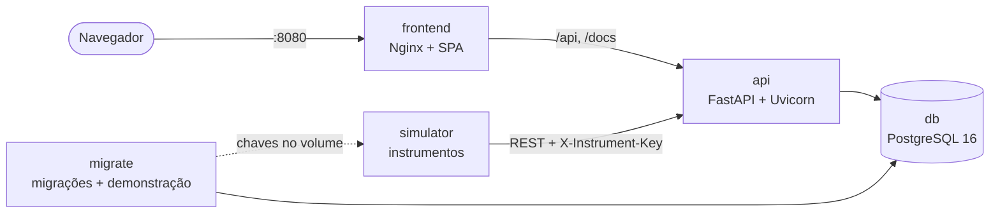

# Execução com Docker

`docker compose up --build` sobe o LabTrack completo: banco, migrações, dados de
demonstração, API, interface e simulador de instrumentos. Só Docker e Docker
Compose v2 são necessários.

```bash
docker compose up --build        # primeira vez: build das imagens e demonstração
# http://localhost:8080          # interface (usuários e senha aparecem no login)
# http://localhost:8080/docs     # Swagger da API
docker compose down              # para tudo; os dados ficam no volume
docker compose down -v           # para tudo e apaga banco e chaves do simulador
```

Usuários da demonstração (senha `Demo@2026`): `carlos.silva` (analista),
`ana.souza` (revisora), `marcos.lima` (gestor) e `admin` (administrador).

## Serviços



| Serviço | Imagem | Papel |
| ------- | ------ | ----- |
| `db` | `postgres:16-alpine` | Banco, com volume `labtrack-db-data`. Cria também `labtrack_test` para os testes. Porta 5432 publicada para desenvolvimento local. |
| `migrate` | `labtrack-backend` | Tarefa única: `alembic upgrade head` e, com `LABTRACK_SEED_DEMO=true`, `seed-demo --if-empty`, que grava as chaves dos equipamentos no volume `simulator-config`. Nas subidas seguintes o banco já tem dados e nada é alterado. |
| `api` | `labtrack-backend` | FastAPI com Uvicorn; só sobe depois que `migrate` termina com sucesso. Não publica porta: é acessada pelo Nginx e pelo simulador na rede interna. Healthcheck em `/api/v1/health/ready` (inclui o banco). |
| `frontend` | `labtrack-frontend` | Nginx com o build do Vite: rotas da SPA, cache dos arquivos com hash, cabeçalhos de segurança e proxy de `/api`, `/docs` e `/redoc` para a API. Porta 8080. |
| `simulator` | `labtrack-simulator` | Mede a worklist dos seis equipamentos em ciclos (`LABTRACK_SIMULATOR_INTERVAL`, padrão 30 s) usando só a API REST. Lê as chaves do volume, somente leitura. |

A ordem de subida é garantida por `depends_on` com condições: banco saudável →
migrações concluídas → API saudável → interface e simulador.

## Imagens

| Imagem | Build | Execução |
| ------ | ----- | -------- |
| `backend/Dockerfile` | *Multi-stage*: dependências numa camada própria (mudar o código não reinstala bibliotecas) e o pacote num virtualenv | `python:3.11-slim` com o virtualenv, as migrações e o script de inicialização; usuário `labtrack` (UID 10001), sem root |
| `frontend/Dockerfile` | *Multi-stage*: `npm ci` e `vite build` no `node:22-alpine` (`VITE_DEMO_MODE` como argumento de build) | `nginx:1.28-alpine` só com os arquivos estáticos e `nginx.conf` |
| `instrument-simulator/Dockerfile` | Instala o pacote (só depende do `httpx`) | Usuário `labtrack` (mesmo UID, para ler as chaves gravadas pelo `migrate`) |

Os `.dockerignore` deixam de fora virtualenvs, `node_modules`, testes, caches e
arquivos `.env`.

## Variáveis

Todas têm padrão para a demonstração; para mudar, copie `.env.example` para `.env`.

| Variável | Padrão | Uso |
| -------- | ------ | --- |
| `LABTRACK_HTTP_PORT` | `8080` | Porta da interface no host |
| `LABTRACK_DB_PORT` | `5432` | Porta do PostgreSQL no host |
| `POSTGRES_USER` / `POSTGRES_PASSWORD` / `POSTGRES_DB` | `labtrack` | Credenciais do banco (usadas também pela API) |
| `LABTRACK_ENVIRONMENT` | `development` | `production` exige `LABTRACK_JWT_SECRET_KEY` própria e bloqueia a demonstração |
| `LABTRACK_JWT_SECRET_KEY` | chave de desenvolvimento | Assinatura dos tokens; recusada em produção se for a padrão |
| `LABTRACK_SEED_DEMO` | `true` | Gera a demonstração na primeira subida |
| `LABTRACK_DEMO_MODE` | `true` | Build da interface listando os usuários de demonstração no login |
| `LABTRACK_DEMO_PASSWORD` | `Demo@2026` | Senha dos usuários de demonstração |
| `LABTRACK_SIMULATOR_INTERVAL` | `30` | Segundos entre os ciclos do simulador |
| `LABTRACK_LAB_TIMEZONE` / `LABTRACK_LAB_NAME` | `America/Sao_Paulo` / nome genérico | Fuso dos indicadores e relatórios; nome no cabeçalho do PDF |

## Rumo à produção

A configuração acima é de demonstração. Para um ambiente real:

1. `.env` com `LABTRACK_ENVIRONMENT=production`, uma `LABTRACK_JWT_SECRET_KEY`
   gerada (`python -c "import secrets; print(secrets.token_urlsafe(48))"`),
   senha forte do banco, `LABTRACK_SEED_DEMO=false` e `LABTRACK_DEMO_MODE=false`.
2. Primeiro administrador:
   `docker compose run --rm -e LABTRACK_ADMIN_PASSWORD=... api python -m app.cli create-admin`.
3. Não publicar a porta do banco e desligar o simulador (`docker compose up -d db
   migrate api frontend`); instrumentos reais usam a mesma API com a chave
   gerada no cadastro.
4. TLS num proxy reverso ou balanceador à frente do Nginx, backup do volume do
   banco e coleta dos logs (a API já escreve JSON com `request_id`).

A API confia nos cabeçalhos `X-Forwarded-*` de qualquer origem
(`FORWARDED_ALLOW_IPS=*`) porque só é alcançável pelo Nginx e pelos serviços
internos. Assim o audit trail registra o IP do cliente, e não o do Nginx.

## Validação

O job **Docker** do CI (`.github/workflows/ci.yml`) constrói as imagens, sobe a
stack com `--wait`, roda `scripts/smoke_test.py` contra a porta publicada, faz
uma segunda subida (dados preservados, demonstração não repetida) e roda o smoke
test de novo. O smoke test confere a interface e as rotas da SPA, os cabeçalhos
de segurança, a API pronta, o Swagger, o login de demonstração, as amostras, o
PDF do relatório com impressão digital, a cadeia do audit trail e resultados
recentes enviados pelo simulador.

```bash
python3 scripts/smoke_test.py --base-url http://localhost:8080
```
