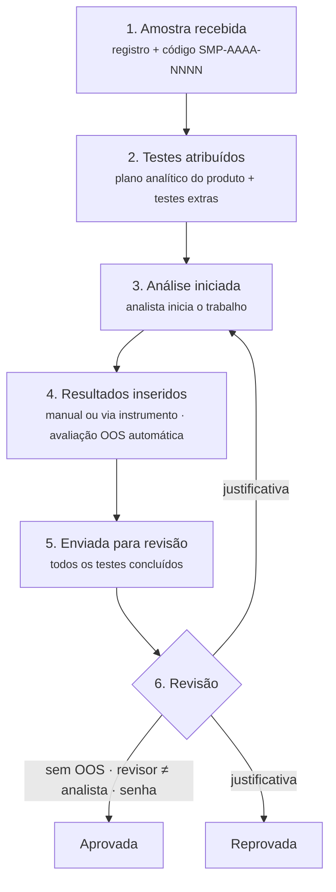
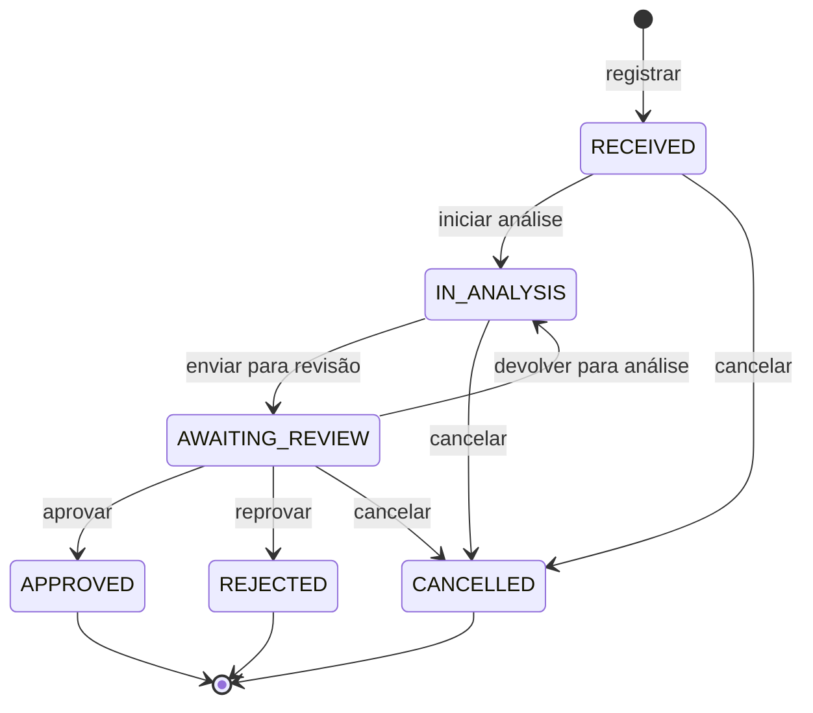
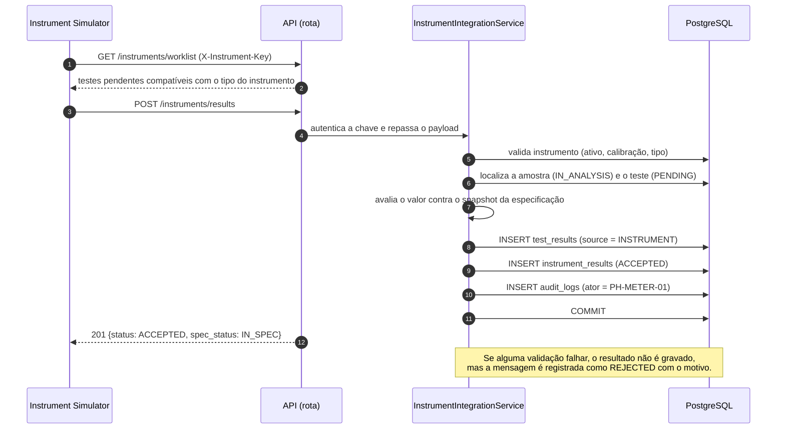

# Ciclo de vida da amostra

## 1. Fluxo de negócio



## 2. Máquina de estados



| Status            | Rótulo na interface | Significado                                          |
| ----------------- | ------------------- | ---------------------------------------------------- |
| `RECEIVED`        | Recebida            | Registrada no laboratório, testes podem ser atribuídos |
| `IN_ANALYSIS`     | Em análise          | Resultados podem ser inseridos e corrigidos          |
| `AWAITING_REVIEW` | Aguardando revisão  | Resultados bloqueados, aguardando o revisor          |
| `APPROVED`        | Aprovada            | Final: liberada                                      |
| `REJECTED`        | Reprovada           | Final: não conforme                                  |
| `CANCELLED`       | Cancelada           | Final: registro invalidado                           |

### Tabela de transições

A tabela abaixo é implementada **literalmente** na camada `domain` como um
mapa `(status atual, ação) → próximo status`. Qualquer combinação fora dela é
recusada com `409 INVALID_STATUS_TRANSITION`.

| De                | Ação                 | Para              | Perfil   | Pré-condições                                                        |
| ----------------- | -------------------- | ----------------- | -------- | -------------------------------------------------------------------- |
| —                 | `register`           | `RECEIVED`        | Analista | Produto e cliente ativos; recebimento não pode estar no futuro       |
| `RECEIVED`        | `start_analysis`     | `IN_ANALYSIS`     | Analista | Pelo menos 1 teste ativo atribuído                                   |
| `IN_ANALYSIS`     | `submit_for_review`  | `AWAITING_REVIEW` | Analista | Todos os testes ativos com resultado (`COMPLETED`)                   |
| `AWAITING_REVIEW` | `approve`            | `APPROVED`        | Revisor  | Nenhum resultado vigente OOS; revisor não inseriu resultados da amostra; senha confirmada |
| `AWAITING_REVIEW` | `reject`             | `REJECTED`        | Revisor  | Justificativa; revisor não inseriu resultados da amostra             |
| `AWAITING_REVIEW` | `return_to_analysis` | `IN_ANALYSIS`     | Revisor  | Justificativa                                                        |
| `RECEIVED`, `IN_ANALYSIS`, `AWAITING_REVIEW` | `cancel` | `CANCELLED` | Gestor | Justificativa                                              |

Toda transição grava uma linha em `sample_status_history` e um evento
`SAMPLE_STATUS_CHANGED` no audit trail, **na mesma transação**.

## 3. Regras de negócio

Cada regra tem um identificador e será coberta por testes automatizados.

### Registro e testes
| ID    | Regra                                                                                                   |
| ----- | ------------------------------------------------------------------------------------------------------- |
| RN-01 | O código da amostra é gerado pelo sistema, único, no formato `SMP-AAAA-NNNN` (sequencial por ano).       |
| RN-02 | Produto e cliente precisam estar ativos.                                                                |
| RN-03 | A data de recebimento não pode estar no futuro.                                                         |
| RN-04 | Ao registrar, os testes do plano analítico do produto são atribuídos automaticamente.                   |
| RN-05 | Testes só podem ser atribuídos em `RECEIVED` ou `IN_ANALYSIS`, precisam estar ativos e não se repetem.  |
| RN-06 | Na atribuição, limites e unidade são copiados (*snapshot*): o limite do produto prevalece sobre o padrão do teste. |
| RN-07 | Apenas testes `PENDING` podem ser cancelados, com justificativa.                                        |

### Workflow
| ID    | Regra                                                                                                   |
| ----- | ------------------------------------------------------------------------------------------------------- |
| RN-08 | A análise só começa com pelo menos um teste ativo atribuído.                                            |
| RN-09 | Resultados só são aceitos com a amostra em `IN_ANALYSIS`.                                               |
| RN-10 | O envio para revisão exige todos os testes ativos concluídos.                                           |
| RN-11 | A partir de `AWAITING_REVIEW`, resultados ficam bloqueados para alteração.                              |
| RN-12 | A aprovação exige: nenhum resultado vigente OOS, revisor diferente de quem inseriu resultados da amostra (princípio dos quatro olhos) e confirmação de senha (conceito de assinatura eletrônica). |
| RN-13 | Reprovação, devolução para análise e cancelamento exigem justificativa.                                 |
| RN-14 | `APPROVED`, `REJECTED` e `CANCELLED` são finais: a amostra não pode mais ser alterada.                  |
| RN-15 | Toda transição gera histórico de status e registro no audit trail.                                      |

### Resultados e OOS
| ID    | Regra                                                                                                   |
| ----- | ------------------------------------------------------------------------------------------------------- |
| RN-16 | Avaliação automática: `IN_SPEC` se `spec_min ≤ valor ≤ spec_max` (limites inclusivos; limite ausente não restringe aquele lado). Caso contrário, `OOS`. |
| RN-17 | Corrigir um resultado cria uma **nova versão** com justificativa obrigatória; a versão anterior é preservada e o audit trail registra valor anterior e novo. |
| RN-18 | Resultado OOS gera alerta visual na interface e evento destacado na timeline. Se um resultado OOS for corrigido, o histórico continua visível e é sinalizado ao revisor: um OOS nunca some sem deixar rastro. |

### Integração com instrumentos
| ID    | Regra                                                                                                   |
| ----- | ------------------------------------------------------------------------------------------------------- |
| RN-19 | O instrumento se autentica pela própria chave (guardada só como hash), e o `instrument_id` do payload deve ser o dono da chave. |
| RN-20 | O instrumento precisa estar `ACTIVE` e com calibração válida (até o dia do vencimento, inclusive).      |
| RN-21 | O tipo do instrumento precisa ser compatível com o equipamento exigido pelo teste.                      |
| RN-22 | A amostra precisa estar em `IN_ANALYSIS` e o teste atribuído e `PENDING`. O instrumento não sobrescreve resultado: correção é manual e justificada. |
| RN-23 | A unidade enviada precisa ser exatamente a unidade especificada para o teste.                           |
| RN-24 | Toda mensagem de resultado recebida é registrada (aceita ou rejeitada, com motivo) e auditada; a recusa aparece na timeline da amostra quando o código existe. |

### Usuários
| ID    | Regra                                                                                                   |
| ----- | ------------------------------------------------------------------------------------------------------- |
| RN-25 | Usuários não são excluídos, apenas desativados. Usuário inativo não autentica.                          |
| RN-26 | Tentativas de login, com sucesso ou não, são auditadas.                                                 |

### Relatórios
| ID    | Regra                                                                                                   |
| ----- | ------------------------------------------------------------------------------------------------------- |
| RN-27 | O relatório de análise só é emitido para amostras revisadas (`APPROVED` ou `REJECTED`); em andamento ou cancelada, a API responde `409 REPORT_NOT_AVAILABLE`. |
| RN-28 | Cada emissão do PDF é registrada no audit trail (`REPORT_GENERATED`) com a impressão digital SHA-256 do conteúdo, a mesma impressa no rodapé. A prévia em JSON não gera registro. O relatório mostra todas as versões de resultados corrigidos (inclusive OOS) e os testes cancelados com justificativa. |

## 4. Avaliação de especificação (OOS)

```
Teste: pH            spec_min = 6.5    spec_max = 7.5    (limites inclusivos)

resultado 7.2  →  6.5 ≤ 7.2 ≤ 7.5  →  IN_SPEC   (Dentro da especificação)
resultado 8.1  →  8.1 > 7.5        →  OOS       (Fora da especificação)
resultado 7.5  →  7.5 ≤ 7.5        →  IN_SPEC   (limite é inclusivo)

Teste: Umidade       spec_min = —      spec_max = 0.5    (especificação unilateral)
resultado 0.3  →  IN_SPEC
resultado 0.7  →  OOS
```

Os valores são `Decimal`/`NUMERIC`, então a comparação é exata.

## 5. Resultado vindo de instrumento



Implementado na ETAPA 8 (`InstrumentIntegrationService`). A amostra é
bloqueada durante a validação, então dois envios simultâneos para o mesmo teste
nunca geram dois resultados: o segundo é recusado como `TEST_ALREADY_COMPLETED`.
Um resultado de instrumento pode ser corrigido pelo analista, como qualquer
outro: a correção cria a versão 2 (`MANUAL`) com justificativa, e a leitura
original do equipamento continua no histórico.

## 6. Sample Timeline

A timeline é montada a partir do audit trail filtrado pela amostra
(`audit_logs.sample_id`). Por isso ela é consistente com a trilha de auditoria:
as duas vêm da mesma fonte.

O endpoint paginado `GET /api/v1/samples/{id}/timeline` está disponível desde
a ETAPA 7; a tela será implementada na ETAPA 9. Os eventos mantêm o nome do
autor no momento da ação, horários UTC, valores e justificativas. As flags
`is_correction` e `has_oos` permitem destacar correções e eventos que tiveram
OOS mesmo quando o resultado vigente já está dentro da especificação.

```
23/09/2026
09:05  Amostra registrada ........................ Carlos Silva (Analista)
09:05  Testes atribuídos: pH, Densidade, Umidade ... Carlos Silva (Analista)
09:10  Análise iniciada .......................... Carlos Silva (Analista)
10:32  Resultado de pH: 7.21 pH, dentro da especificação .... PH-METER-01
10:35  Resultado de Densidade: 1.023 g/mL, inserido manualmente ... Carlos Silva
10:41  Resultado de Umidade: 0.42 %, dentro da especificação ... MOISTURE-01
10:58  Densidade corrigida: 1.023 → 1.032 g/mL ("erro de transcrição") ... Carlos Silva
11:15  Enviada para revisão ...................... Carlos Silva (Analista)
11:52  Amostra aprovada .......................... Ana Souza (Revisora)
```

## 7. Eventos do audit trail

| Ação                        | Quando                                       | Valor anterior → novo                 |
| --------------------------- | -------------------------------------------- | ------------------------------------- |
| `LOGIN_SUCCEEDED` / `LOGIN_FAILED` | Tentativa de login                    | —                                     |
| `USER_CREATED` / `USER_UPDATED`    | Gestão de usuários                    | campos alterados                      |
| `TEST_DEFINITION_UPDATED`   | Alteração de limites, método, equipamento    | limites antigos → novos               |
| `SAMPLE_CREATED`            | Registro                                     | — → dados da amostra                  |
| `SAMPLE_UPDATED`            | Edição de dados de registro                  | campos alterados                      |
| `TESTS_ASSIGNED` / `TEST_CANCELLED` | Atribuição / cancelamento de teste   | —                                     |
| `SAMPLE_STATUS_CHANGED`     | Qualquer transição                           | status anterior → novo                |
| `RESULT_ENTERED`            | Primeiro resultado do teste                  | — → valor, `spec_status`, origem      |
| `RESULT_AMENDED`            | Correção de resultado                        | 7.3 → 7.1 + justificativa             |
| `INSTRUMENT_MESSAGE_REJECTED` | Mensagem de instrumento recusada           | — → motivo                            |
| `REPORT_GENERATED`          | Emissão do relatório em PDF                  | — → formato, status, impressão digital |
